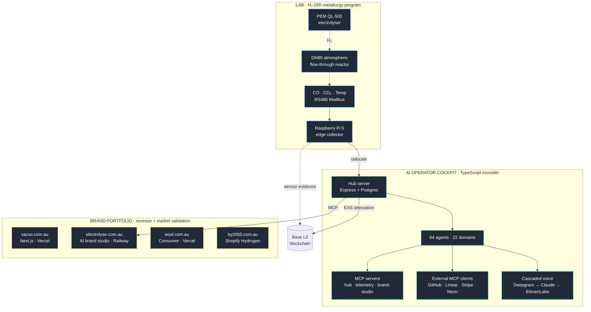

# VACSO Systems Architecture

A high-level map of what runs where, how it connects, and the trade-offs behind the major engineering choices. Everything described here is in production today — exact code is in private repos, but every URL resolves and every protocol below is observable in real time.

## Three rings, one operator



The cockpit is the differentiator. Most life-OS or AI-agent products serve one ring. VACSO's runs across all three, with the same memory layer, the same agents, and the same operator surface.

## Lab data flow

The reactor itself is dumb — instrumentation and provenance live above it.

```
                 ┌─────────────────────────┐
                 │  RS485 Modbus RTU bus   │
                 │  (CO · CO₂ · T · IR)    │
                 └────────────┬────────────┘
                              │  poll @ 5s
                              ▼
                 ┌─────────────────────────┐
                 │  pi-collector (Pi 5)    │
                 │  Modbus → InfluxDB →    │
                 │  retry queue → uplink   │
                 └────────────┬────────────┘
                              │  Tailscale → vacsoserver
                              ▼
                 ┌─────────────────────────┐
                 │  Telemetry server       │
                 │  • PostgreSQL (events)  │
                 │  • InfluxDB (timeseries)│
                 │  • Anthropic Vision     │
                 │    (equipment classify) │
                 │  • Cantera + ONNX       │
                 │    (physics sidecar)    │
                 └────────────┬────────────┘
                              │
                ┌─────────────┴────────────┐
                ▼                          ▼
       ┌────────────────┐       ┌─────────────────────┐
       │  Hub cockpit   │       │  EAS attestation    │
       │  (AI agents +  │       │  on Base L2         │
       │   workshop UI) │       │  per-batch evidence │
       └────────────────┘       └─────────────────────┘
```

Two separate persistence stacks because the access patterns differ: PostgreSQL for transactional events ("batch X started", "alert Y acknowledged") with foreign keys and joins; InfluxDB for high-volume time series. The Pi can survive a network outage — local InfluxDB buffers, retry queue forwards on reconnect. CO safety alarm is enforced **on the Pi**, not in the cloud, so a network drop doesn't disable safety.

## The cockpit, internally

### Surface

Single TypeScript codebase. Express server, React client (Vite), Postgres with pgvector. ~170 forward-only SQL migrations, auto-applied on startup. Drizzle is types-only — raw SQL is the source of truth (a deliberate choice; the ORM's migration story doesn't survive cross-environment operation). Logger is structured (Pino-style) with secret redaction.

### Agents

64 specialist agents across 22 domains (planning, execution, brand, knowledge, telemetry, voice, …). Each agent is a typed prompt + tool list + model routing config. Cost-aware routing — Haiku for triage, Sonnet for synthesis, Opus where reasoning depth genuinely pays. Agents never call LLMs directly from services; everything goes through the planning domain so token spend, latency, and traces are uniformly captured.

### MCP, both directions

The Hub **exposes** three MCP servers (hub, telemetry, brand-studio) so external Claude/Cursor sessions can read knowledge, query experiments, and act on brand assets. It also **consumes** external MCP servers — GitHub, Linear, Stripe, Neon, Playwright, Slack — through a single `mcp_call` chat tool. Inbound + outbound on the same protocol means agents can hand off work between systems without a glue layer.

### Voice

Currently migrating from OpenAI Realtime (single-model, fast to ship) to a cascaded stack: Deepgram for STT, Claude for LLM, ElevenLabs for TTS, LiveKit Cloud for transport. The cascaded path is more code but the per-component swap-out matters more than latency for our use case — we want the same agent behaviour across voice and text, which means owning the LLM step.

## Brands ring

Each brand is a separate deployable, stack picked for its use case rather than enforced uniformity:

| Brand | Stack | Why |
|---|---|---|
| **VACSO** corporate ([vacso.com.au](https://vacso.com.au)) | Next.js · Vercel | Fast static, edge cache, low ops |
| **Electrolyse** AI brand studio ([electrolyse.com.au](https://electrolyse.com.au)) | Next.js · Prisma · BullMQ · Railway | Real backend — Flux.1 Pro photo gen, Vision Guard QA, Cloudinary CDN, content radar |
| **WIYD** ([wiyd.com.au](https://www.wiyd.com.au)) | Next.js · Vercel | Marketing site for the consumer Hub product |
| **by 2050** ([by2050.com.au](https://by2050.com.au)) | Shopify Hydrogen · React Router 7 | Headless commerce on a real PIM, no rolling our own product/inventory/checkout |

All four extend a shared Renovate preset ([`vacso-config`](https://github.com/VACSO-ORG/vacso-config)) for dependency hygiene. Cross-cutting infra and ops live in [`vacso-ops`](https://github.com/VACSO-ORG/vacso-ops).

## Key engineering choices and the trade

| Choice | Tradeoff |
|---|---|
| **Raw SQL + Drizzle types-only** | Schema drift can't hide behind an ORM; everyone reads the actual SQL. Cost: less ORM ergonomics; we wrote a tiny query helper instead. |
| **One TypeScript monolith for the cockpit** | Cross-domain refactors are one PR, not ten. Cost: build times grow; addressed with project references, not service splits. |
| **PostgreSQL + InfluxDB instead of one TSDB** | OLTP joins for events, time-series compression for sensor streams. Cost: two systems to operate; mitigated by InfluxDB being optional (graceful degradation if unreachable). |
| **Atmospheric H₂-DRI rig (not pressurised)** | Safety envelope is enormously easier to defend; no compressed-H₂ vessels above ambient. Cost: utilisation ceiling, slower kinetics. Acceptable for a research-grade rig validating chemistry, not a pilot plant. |
| **Edge safety enforcement on Pi** | CO alarm fires even with network down. Cost: Pi software is its own deployable — addressed by `pi-collector` being deliberately tiny (~500 LOC). |
| **Cascaded voice over single-model Realtime** | Swap any component (STT, LLM, TTS) without rewriting the agent. Cost: more orchestration, more latency budget management — Kwindla's <800ms voice-to-voice target. |
| **Blockchain (EAS on Base) for experiment provenance** | Cheap, public, third-party-verifiable record of what happened in the lab. Cost: only useful if we keep doing it consistently — automated, not manual. |
| **OpenTelemetry traces alongside Langfuse** | Avoid lock-in; industry is converging on OTel GenAI semconv. Cost: dual emission until tooling settles. |
| **Memory layer is Postgres rows today, Mem0/Letta-style next** | Honest acknowledgement: this is a known frontier gap. Closing it is current work, not done. |

## What's deliberately not built yet

- Full eval harness (LLM-as-judge, golden traces in CI gating PRs) — Langfuse currently does tracing, not gating. Hamel-style eval gates are next.
- Multi-tenant Hub. Architecture supports it (per-user dream/agent/memory scopes already exist), but consumer rollout is gated behind dogfood proof.
- Full MOE / molten-oxide path in the lab. Chemistry is documented in [`chemistry/REDUCTION-CHEMISTRY.md`](chemistry/REDUCTION-CHEMISTRY.md); engineering effort is at least an order of magnitude beyond H₂-DRI; not on the roadmap.

## See also

- [`README.md`](README.md) — overview of this repo
- [`chemistry/REDUCTION-CHEMISTRY.md`](chemistry/REDUCTION-CHEMISTRY.md) — why H₂-DRI is the right route for this decade
- [`chemistry/MODELLING-AND-RECENT-STUDIES.md`](chemistry/MODELLING-AND-RECENT-STUDIES.md) — six modelling tracks ranked by effort vs insight
- [`hardware/HARDWARE-SETUP.md`](hardware/HARDWARE-SETUP.md) — the lab telemetry stack in detail
- [`protocols/H2-DRI-FIRST-RUN.md`](protocols/H2-DRI-FIRST-RUN.md) — first-run lab SOP
